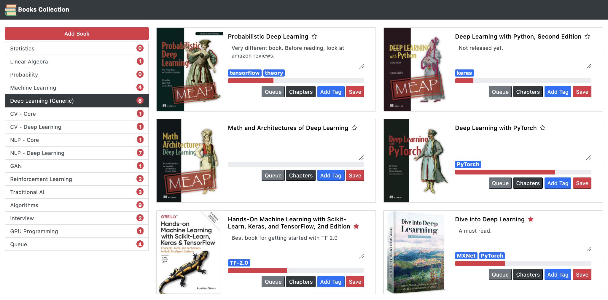
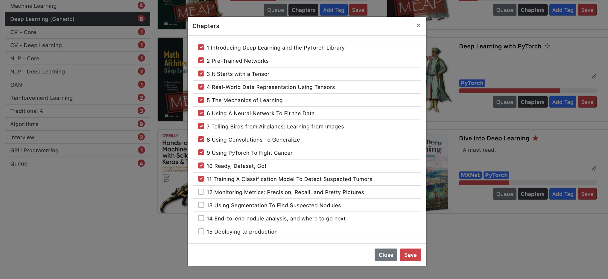
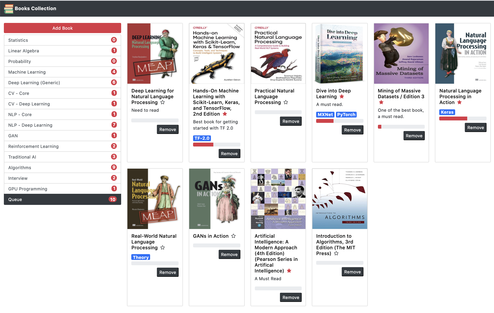
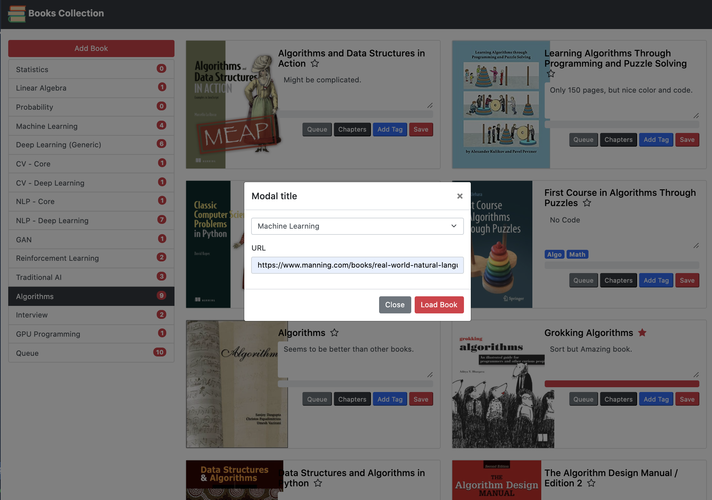

# My Book Collection - A personalized Library
This is a small to keep track of my book collection so that I can,
1. Look at all the important books I need to read.
2. Categorize them accordingly.
3. Track progress of my reading by chapters.
4. Queue them as needed.
5. Add tags to denote programming languages, code vs theory, complexity etc

## Technical Details
- The app has been written using Python Flask (Backend) and Bootstrap (Frontend)
- All the data is stored in json file
- Can automatically capture data from amazon, manning, oreilly and barnesandnoble.
- Captures the Table of Contents if available.

## Screen-prints
### Default Page
    - Click on 'star' to rate a book. Click again to undo rating.
    - Click on 'Add Tag' to add tags for the book. Multiple Tags can be added using comma.
    - Add the notes and click on save to save them to json.
    - Click on 'Chapters' to see all the chapters.
    - Progress will be displayed base on how many chapters have been completed.
    - Click on 'Queue' to push to book to current queue.

### Chapters Page
    - Check the chapters already read.
    - The progress will be displayed based on this selection.

     
### Queue Page
    - Shows the current queue.
    - Click on remove to delete from Queue. 

### Add New Book
    - Click on 'Add Book' to add any book from any of the below website:
        - Amazon
        - Manning
        - Oreilly
        - Barnesandnoble
    - The chapters will be extracted (Except Amazon) including the image and title automatically. 
   

## Copyright
- The code is free to use for commercial or non-commercial use. 
